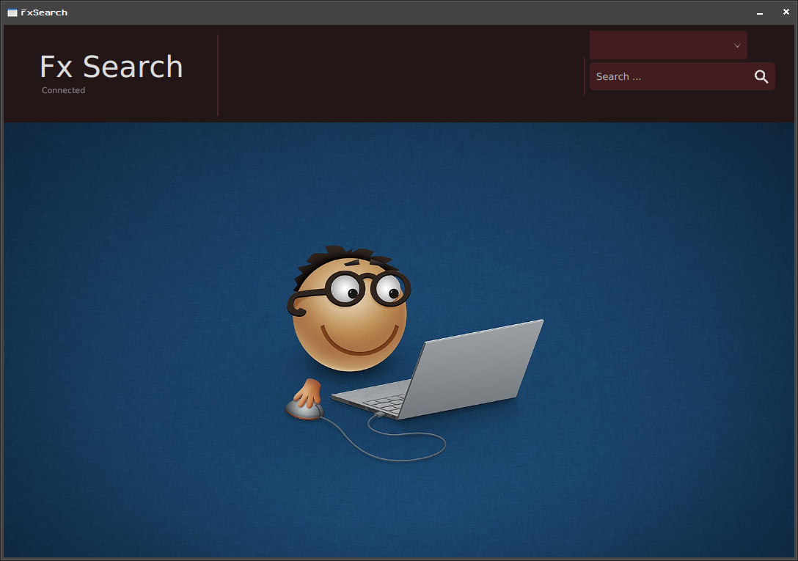
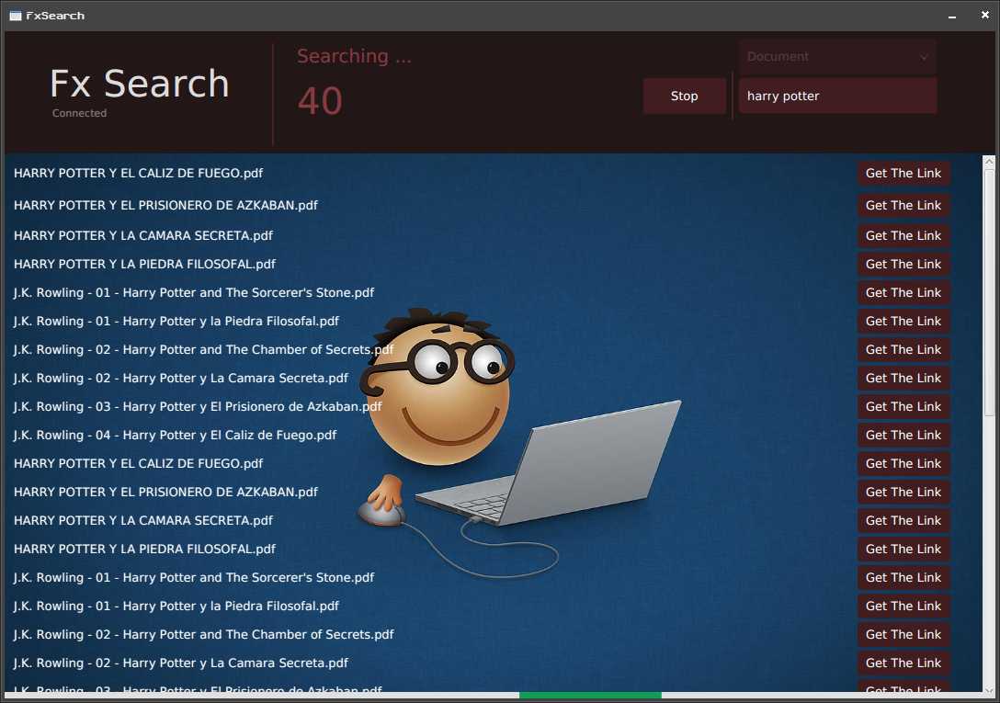

# FX Search
## Search tool using Google Dorks, to find useful stuffs.

- Programming language : JavaFx
- Used libraries : Jsoup (Network communication), JFoenix (Useful widgets)
- Supported format : 
  - Documents `{"pdf", "doc", "docx", "webm"}`
  - Audio `{"mp3", "wav"}`
  - Video `{"mp4", "wma", "aac", "avi", "flv", "mov", "mkv"}`
  - Pictures `{"png", "jpg","gif"}`

Example : 

